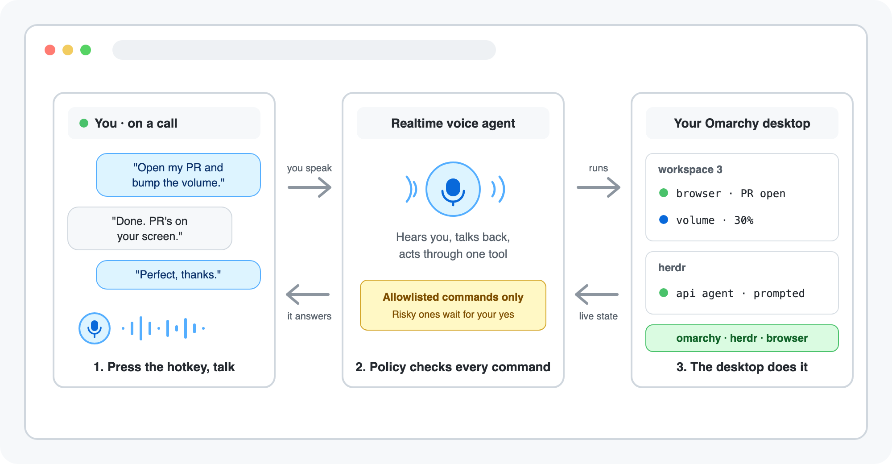

<h3 align="center">Say what you want done and your desktop does it, from switching workspaces to steering your coding agents</h3>

Omarvis lets you hand desktop work to a voice agent when stopping to click through it would break your flow, by putting a realtime <a href="https://omarchy.org">Omarchy</a> voice session one hotkey away and letting it run only allowlisted Omarchy, Hyprland, Herdr, and browser commands.

✓&nbsp;One&nbsp;hotkey,&nbsp;never&nbsp;always&#8209;on &nbsp; ✓&nbsp;Every&nbsp;command&nbsp;parsed&nbsp;and&nbsp;allowlisted &nbsp; ✓&nbsp;Phone&nbsp;control&nbsp;never&nbsp;leaves&nbsp;your&nbsp;tailnet

 

## Keep your hands on the work while the desktop keeps up

A workspace switch, a theme change, a prompt to a stalled coding agent, or a browser errand happens while you keep typing. You say it once, the strip under the bar shows the agent heard you, and the result lands on your screen instead of on a to-do list.

## Choose between memorizing keybindings, dropping into a terminal, pasting into a chat tab — or talking to your desktop

| | **Omarvis** | Keybindings | A terminal | Chat in a browser tab |
|---|:---:|:---:|:---:|:---:|
| **Free to use** | ✅ | ✅ | ✅ | ✅ |
| **Works offline** | ❌ | ✅ | ✅ | ❌ |
| **Hands stay on your work** | ✅ | ❌ | ❌ | ❌ |
| **No syntax to remember** | ✅ | ❌ | ❌ | ✅ |
| **Switches workspaces and apps** | ✅ | ✅ | ✅ | ❌ |
| **Steers Herdr coding agents** | ✅ | ❌ | ✅ | ❌ |
| **Drives your logged-in browser** | ✅ | ❌ | ❌ | ❌ |
| **Types dictation into any window** | ✅ | ❌ | ❌ | ❌ |
| **Asks out loud before anything risky** | ✅ | ❌ | ❌ | ❌ |

Keep typing. Omarvis carries the errand, Python policy code checks every command against an allowlist, and the risky ones wait for your spoken yes.

## Say the change once. Watch it land on your screen.

### 📈 Ask about your screen and hear a straight answer

Every session starts knowing your workspace number, open windows, Herdr agents, and browser tabs. Ask about something visible and Omarvis captures one screenshot, looks at it, and answers out loud instead of making you read anything.

### ⚡ Hand off the desktop errand mid-sentence

Switch workspaces, launch apps, change themes, set volume and brightness, take screenshots, set reminders, lock the screen. The same voice prompts and rearranges your Herdr coding agents and drives Chromium to open pages, click, and fill fields.

### 💬 Hold a key and your words are typed for you

Hold Super+J, speak, release. The transcript is typed into the focused window. Press Space while holding to keep the mic open hands-free, then tap Super+J to type it. Dictation is the only way Omarvis types into your apps, and it types only what you actually said.

## Talk to your desktop in three steps

<table>
<tr>
<td align="center" valign="top" width="33%"><h3>1️⃣</h3><b>Install and run setup</b> Run <code>omarchy plugin add https://github.com/eliasstravik/omarvis.git --enable --yes</code>, then run <code>~/.config/omarchy/plugins/io.github.eliasstravik.omarvis/bin/omarvis-setup</code>. It installs its own dependencies.</td>
<td align="center" valign="top" width="33%"><h3>2️⃣</h3><b>Paste your ElevenLabs key</b> Setup asks once, stores the key readable only by you, and adds the J-key bindings after a timestamped backup of your config.</td>
<td align="center" valign="top" width="33%"><h3>3️⃣</h3><b>Press Super+Ctrl+J and talk</b> Say "switch to workspace 2" and watch it happen. Press the hotkey again to hang up.</td>
</tr>
</table>

## Get your questions answered

### Do I need to know how to code?

No. The setup script installs the audio and browser dependencies, writes its runtime files, and asks for your ElevenLabs API key. The only thing you type is that key, once.

### Is Omarvis always listening?

No. There is no wake word. A session starts only when you press Super+Ctrl+J or click the bar widget, is capped at five minutes, and nothing leaves your machine while Omarvis is idle.

### Can the agent run arbitrary shell commands?

No. Python policy code parses every command with `shlex`, checks the route and flags against an allowlist, and executes the argument list with `shell=False`. There is no general shell access, no arbitrary JavaScript, and no agent-chosen keystrokes into ordinary windows.

### What needs my spoken confirmation?

Installing or removing software, running terminal commands, closing Herdr resources, uploading or downloading files, and power actions. The daemon records the exact parsed command, waits for you to actually speak, and accepts the yes for 30 seconds. Deletes and power actions re-ask every time.

### Can I talk to it from my phone?

Yes. Turn on Remote access in the panel and scan the QR from a phone on the same tailnet. The URL is served through Tailscale Serve only, never Funnel or the public internet — but anyone holding that URL can drive your machine, so treat the QR like a credential. [`docs/reference.md`](docs/reference.md#remote-control-from-your-phone) covers the full model.

### Which browser does it drive, and as whom?

Chromium, through `agent-browser`. By default Omarvis opens a fresh snapshot copy of your real profile, so your logins work but nothing is written back. A separate persistent profile and a direct attach to your running browser are also supported.

### What does a session cost?

The plugin is free and MIT licensed. ElevenLabs bills Agents sessions by conversation minute, plus pass-through LLM usage. Sessions are capped at five minutes and start only on your hotkey press.

### What gets sent to ElevenLabs?

During a session: your microphone audio, your profile memory, the command catalogs, and your window titles, workspace number, Herdr agent names, and browser tab titles and hosts. A desktop screenshot is uploaded only when you explicitly ask about your screen. Nothing is sent while idle.

### What does setup install?

Two distro packages through `omarchy pkg add` (`portaudio` and `python-pyaudio`, plus `wtype` for dictation and `chromium` if you have no browser), a private Python virtualenv from a hash-locked `requirements.lock`, the `agent-browser` 0.34.0 native binary taken out of its pinned npm tarball and verified against committed sha256 digests (no npm, no install scripts), and the sha256-pinned ElevenLabs browser client. Everything lands under `~/.local/share/omarvis` and `~/.config/omarchy/omarvis`. Remote access additionally needs Tailscale, which you install and sign in to yourself. The [reference](docs/reference.md#reproducible-install) lists every artifact and how it is verified.

### How do I uninstall it?

Run `omarchy plugin remove io.github.eliasstravik.omarvis` and delete the two runtime directories. Setup never touched your keybindings without asking and kept a timestamped backup. The [getting-started guide](docs/getting-started.md#uninstall) has the exact steps.

### What does Omarvis not do?

No wake word, no always-on listening, no general shell access, no arbitrary JavaScript evaluation, and no tmux control. Dictation is the sole typing path and it types only your own transcript.

## Take your first voice session in five minutes

One install and one pasted key stand between you and a desktop that answers. Omarvis relays the words and guards the commands. Your desktop does the work.

✓&nbsp;One&nbsp;hotkey,&nbsp;never&nbsp;always&#8209;on &nbsp; ✓&nbsp;Every&nbsp;command&nbsp;parsed&nbsp;and&nbsp;allowlisted &nbsp; ✓&nbsp;Phone&nbsp;control&nbsp;never&nbsp;leaves&nbsp;your&nbsp;tailnet

